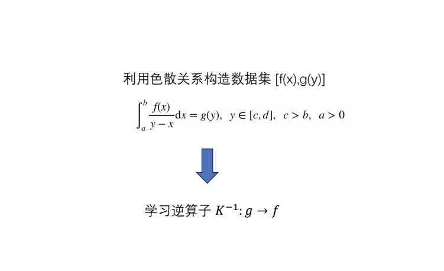

## 反问题


## 运行环境配置

### 环境依赖
* python 3.8.2

如果觉得 Python 3.8.2 不好下载，那么使用其他版本也行，但是在下载requirements.txt中的依赖时可能版本号会发生冲突或者缺失，按照中断的提示调整一下就行。

## 运行

### 创建虚拟环境(Windows-Python3.8.2)

假设系统中已经安装了`Python 3.8.2`，打开`CMD`，输入以下命令查看python的路径
```bash
D:\Users\Administrator\Desktop\111\calc-k>where python
...
D:\ProgramEnv\python_3_8_2\python.exe       <- 这就是要找的
```
使用`Python 3.8.2`创建虚拟环境
```bash
D:\ProgramEnv\python_3_8_2\python.exe -m venv venv
```
### 创建虚拟环境(想用系统现有的Python看这个)
如果懒得使用Python3.8.2，直接使用系统的python，那就直接执行以下命令创建虚拟环境
```bash
python -m venv venv
```

### 在虚拟环境中安装依赖
激活虚拟环境，并下载Python环境依赖
```bash
.\venv\Scripts\activate
pip install -r requirements.txt
```
### 执行代码
执行命令如下
```bash
./run.bat cnn load 20
```
参数列表如下
* 第一个参数: cnn/unet，分别表示两种不同的网络
* 第二个参数: load/train 分别表示加载模型或者直接训练模型
* 第三个参数: 用来可视化的数据索引数